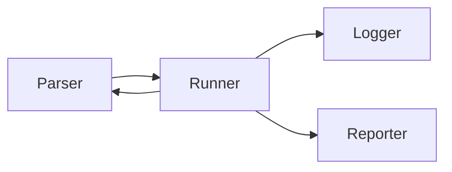

# QKeep

## Qkeep architecture



## Qkeep folder structures

```js
qkeep // root qkeep folder (global level)
|- schema
|- suit_1 // suit folder (suit level)
|  |- scenario_1 // scenario folder (scenario level)
|  |  |- test_1.yaml // test file (test level)
|  |  |- test_2.yaml // test file (test level)
|  |  |- scenario.yaml  // general setting for scenario
|  |- scenario_2 // scenario folder (scenario level)
|  |  |- test_1.yaml // test file (test level)
|  |  |- test_2.yaml // test file (test level)
|  |  |- scenario.yaml  // general setting for scenario
|  |- suit.yaml  // general setting for suit
|- suit_2 // suit folder (suit level)
|  |- scenario_1 // scenario folder (scenario level)
|  |  |- test_1.yaml // test file (test level)
|  |  |- test_2.yaml // test file (test level)
|  |  |- scenario.yaml  // general setting for scenario
|  |- scenario_2 // scenario folder (scenario level)
|  |  |- test_1.yaml // test file (test level)
|  |  |- test_2.yaml // test file (test level)
|  |  |- scenario.yaml  // general setting for scenario
|  |- suit.yaml  // general setting for suit
|- qkeep.yaml // general setting for qkeep
```

## Levels

Qkeep run in 3 levels

- Global level (Qkeep folder)
- Suit level (Suit folder)
- Scenario level (Scenario folder)

each level has its own setting file (yaml file)

## How Qkeep run


## Definitions

- **Qkeep**: Qkeep is a test framework that can run test cases in different levels (global, suit, scenario, test)
- **Suit**: Suit is a folder that contains scenarios
- **Scenario**: Scenario is a folder that contains tests, flows, to fulfill your test purpose
- **Test**: Test is a file that contains test cases
- **Flow**: A flow to run tests in order

### Define a global setting

All the setting files have the same structure

```yaml
base_url: http://localhost:3000
headers:
  Content-Type: application/json
  Accept: application/json
```

and the inner most setting will override the outer one. These setting can be override by definition in test file

### Define scenario setting

Just like global setting, scenario setting can be defined in `scenario.yaml` file

```yaml
base_url: http://localhost:3000
headers:
  Content-Type: application/json
  Accept: application/json
flows:
    - name: Simple get API key flow
      steps:
        - get_token
        - get_apikey
```

The steps in flows are the file name of test file without extension, in this case, the test file should be `get_token.yaml` and `get_apikey.yaml`

### Define a test

```yaml
name: "[Token] -- GET /token"
cases:
    - name: Success
        request:
            path: /token
            method: GET
            body:
                username: admin
                password: admin
        assertions:
            - name: Should return 200
              on: status_code
              check: exact
              expect: 200
            - name: should return token
              on: body
              check: exist
              expect: $body.token
            - name: body should be api get response schema
              on: body
              check: schema
              expect: $schema.api_get_response
            - name: Should return a valid token
              on: body
              check: type
              expect:
                $body.token: regex::^[a-zA-Z0-9]{32}$
                $body.created_at: datetime::iso8601
                $body.created_at: datetime::today
                $body.expires_at: int::range::1-24
        variables:
            token: $body.token
            "$global.token": $body.token
            "$suit.token": $body.token
    - name: Not found
        request:
            path: /token
            method: GET
            body:
                username: admin_not_found
                password: admin_not_found
        assertions:
            - name: Should return 404
              on: status_code
              check: exact
              expect: 404
            - name: body should be api get response schema
              on: body
              check: schema
              expect: $schema.error_response
            _ name: Should return apikey not founder error code
              on: body
              check: exact
              expect: $body.details.code

```

## Special variables

- `$global`: global variables
- `$suit`: suit variables
- `$scenario`: scenario variables
- `$schema`: schema variables
- `$body`: response body

## How to assert response

### Type of assertion

- `exact`: check if the value is exactly the same value and same type
- `exist`: check if the value is exist (not null, not undefined)
- `type`: check if the value is the same type (and type syntax)
- `schema`: check if the value is match the schema

### Target to assert

- `status_code`: status code of response
- `body`: body of response
- `headers`: headers of response

### Type syntax

#### Primary type

- `int`: integer
- `float`: float
- `string`: string
- `bool`: boolean
- `null`: null

#### Complex type

- `object`: object
- `object::schema::value`: object with schema
- `array`: array
- `array::schema::value`: array with schema
- `int::range::min-max`: integer with range
- `int::(gte|gt|lte|lt)::value`: integer with condition
- `float::range::min::max`: float with range
- `float::(gte|gt|lte|lt)::value`: float with condition
- `string::regex::value`: string with regex
- `string::length::min::max`: string with length
- `datetime::iso8601`: datetime with iso8601 format
- `datetime::today`: datetime within today
- `datetime::(gte|gt|lte|lt)::value`: datetime with condition
- `datetime::between::start::end`: datetime with range

Example: define a schema

```yaml
# error_response.yaml
type: object
properties:
    code: int
    message: string
    details:
        type: object
        properties:
            code: int::range::400000::599999
            message: string
```
